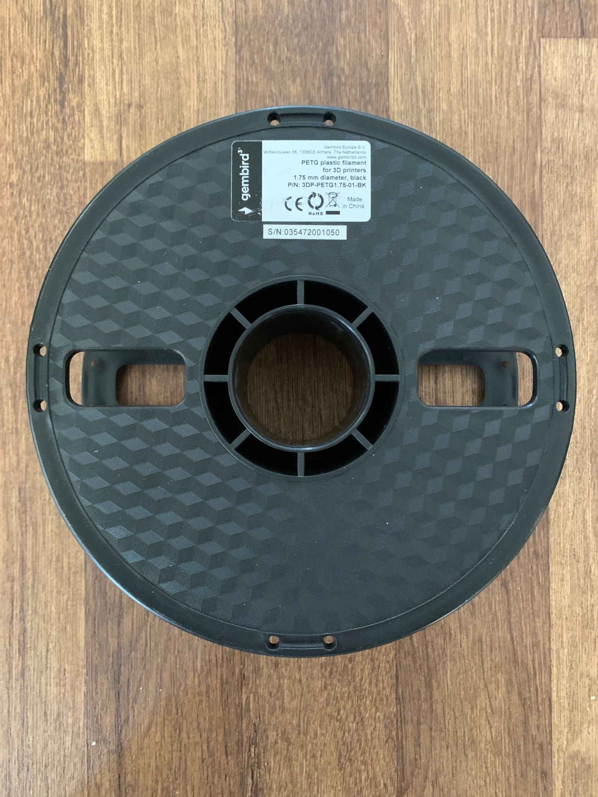
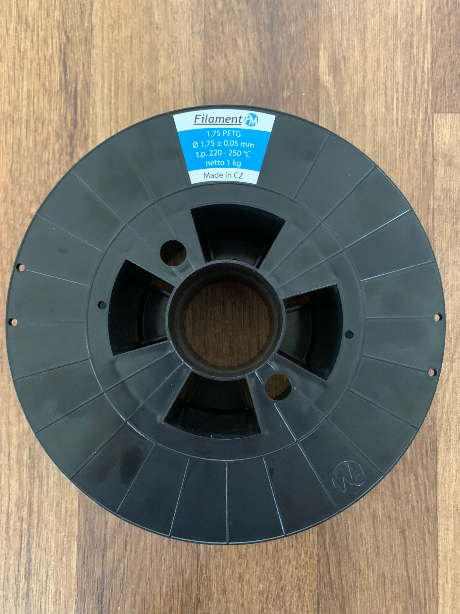
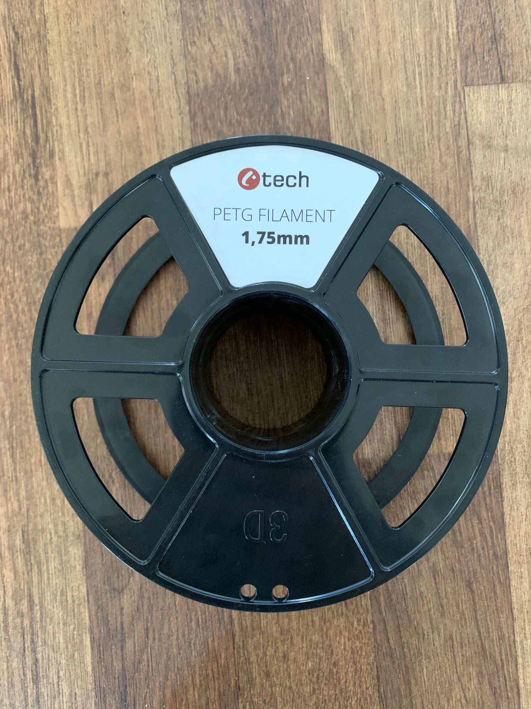
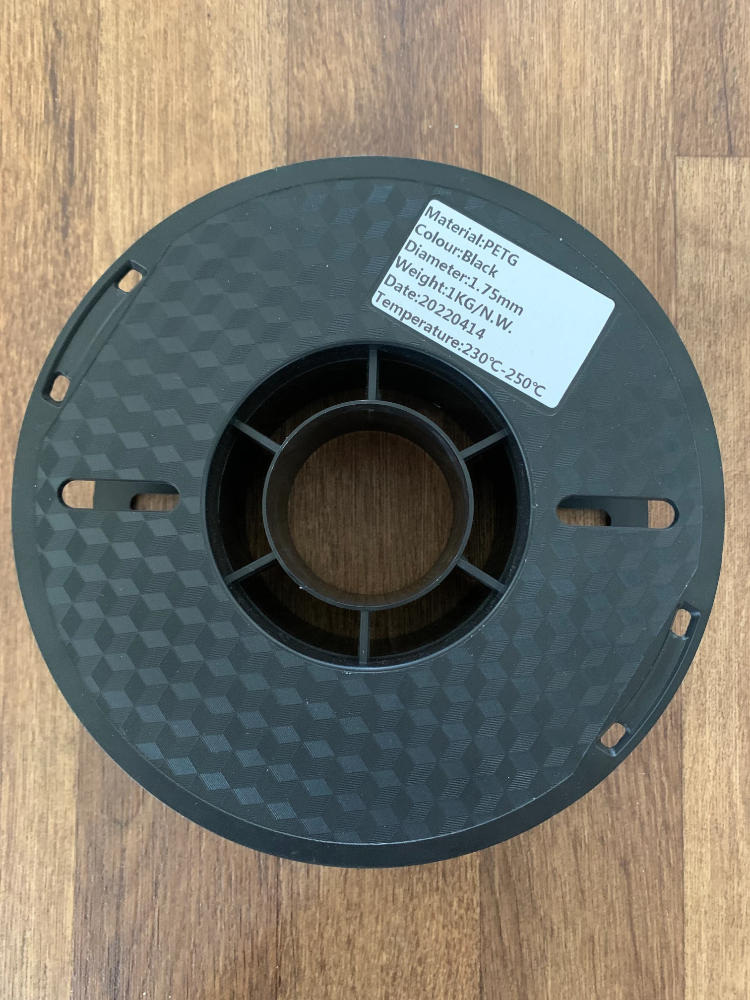

# filament-spool-weight
List of spool weight i have measured...

| Brand | Weight | Material | P/N | Spool weight | Picture |
|---------|---------|---------|---------|---------|---------|
| Gembird | 1kg | PET-G | (3DP-PETG1.75-01-BK) | 248g |  |
| FilamentPM | 1kg | PET-G | - | 212g |  |
| C-Tech | 1kg | PET-G | - | 114g |  |
| ??? | 1kg | PET-G | - | 164g |  |
